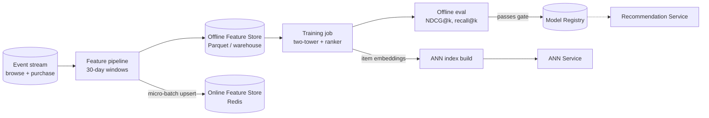

# Architecture

## The shape of it

Online, synchronous, two-stage. A request comes in, we retrieve a few hundred candidates, we rank
them, we respond. Sitting behind that are an online feature store and a model registry we pull
artifacts from at runtime. Everything expensive — generating embeddings, building the candidate
index, training — runs offline on a schedule and never touches the request path.

That split is the whole trick. The request path only does a feature lookup, an ANN candidate
fetch, and a ranking pass, all bounded in cost, which is how we hold 800 RPS under 120 ms p95 on
plain CPU. The reasoning is in [`JUSTIFICATION.md`](JUSTIFICATION.md), and the two decisions I'd
defend hardest are written up as [ADRs](adr/).

## Request path (online)

```mermaid
flowchart LR
  C[Mobile app<br/>home-screen load] -->|HTTPS| GW[API Gateway / CDN edge<br/>auth, rate-limit, routing]
  GW --> SVC[Recommendation Service<br/>FastAPI + ONNX Runtime<br/>12-20 replicas, CPU]

  subgraph Online serving (stateless, hot path)
    SVC -->|user + context features| FS[(Online Feature Store<br/>Redis, p99 < 10ms)]
    SVC -->|candidate retrieval| ANN[ANN Service<br/>two-tower index<br/>top-500 candidates]
    SVC -->|score candidates| RANK[Ranking model<br/>ONNX Runtime, in-process]
    SVC -->|cold-start fallback| FB[Popularity / segment<br/>model - cached]
  end

  SVC -->|response + X-Model-Version| GW
  GW --> C

  REG[(Model Registry<br/>artifacts + metadata)] -.->|init container<br/>pulls model by version| SVC
  EXP[A/B Experiment Config] -.->|arm to model-version map| SVC

  SVC -->|metrics, traces, logs| OBS[(Observability<br/>Prometheus + OTel + Loki)]
```

## Offline / batch path



## Components

| Component | Responsibility | Tech | Latency target |
|---|---|---|---|
| API Gateway / CDN edge | TLS, authN/Z, rate limiting, routing | Managed gateway | ≤ 5 ms server-side |
| Recommendation Service | Orchestrates feature fetch → retrieve → rank; stamps `X-Model-Version` | FastAPI, ONNX Runtime | ≤ 70 ms server-side p95 |
| Online Feature Store | Serves precomputed 30-day user features | Redis | p99 < 10 ms |
| ANN Service | Two-tower candidate retrieval (top-500) | FAISS/ScaNN-style | < 20 ms |
| Ranking model | Scores candidates, returns top-N | ONNX, in-process | < 35 ms |
| Cold-start fallback | Popularity/segment recs when no history | In-memory cache | < 5 ms |
| Model Registry | Versioned artifacts + lineage + stage | See `lifecycle/model-registry.yaml` | n/a (offline) |
| A/B Experiment config | Maps experiment arm → model version | Config service | n/a |

## How the model actually gets into the service

The image doesn't contain the ranker. When a pod starts, an init container looks up which model
version the experiment config wants, pulls that artifact from the registry's object store into a
shared volume, and the service memory-maps it. That's the mount approach (ADR-0002), and it's the
reason a new experiment arm is a config change rather than a deploy. Whatever version ends up
loaded gets stamped onto every response as `X-Model-Version`, which is also how
[monitoring](../monitoring/alerts.yaml) notices if an arm is ever serving the wrong version.

## Latency budget (the one-liner)

p95 is 120 ms end to end, split roughly: 35 ms network, 5 ms gateway, 15 ms feature fetch, 20 ms
ANN, 35 ms ranking, 10 ms serialization. The full breakdown and the replica math are in
[`serving/capacity-plan.md`](../serving/capacity-plan.md).
