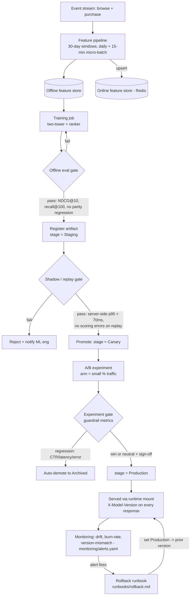

# Model lifecycle

How a model gets from raw events to actually serving traffic, and the gates it has to clear on
the way. The gates have named owners on purpose — "gets reviewed" isn't a gate, "the serving SRE
signs off after shadow replay" is. The registry fields backing each stage are in
`model-registry.yaml`.

## The flow

## The gates, and who owns them

**Staging.** Entry is automated: offline eval has to clear `NDCG@10 ≥ baseline` and
`recall@100 ≥ baseline`, and the training-data parity check has to pass. The ML engineer who owns
the model is on the hook here. Backed by the `metrics`, `lineage`, and `training_data_snapshot`
fields.

**Canary.** We replay 24 hours of real traffic in shadow. It has to come back with server-side
p95 under 70 ms and zero scoring errors. The serving SRE signs off — this is their call, not the
model author's, because it's a serving question, not a quality one. Backed by `eval.shadow` and
`artifact.digest`.

**Production.** Two things both have to be true: the A/B guardrails are met (no CTR regression,
latency and errors inside SLO), *and* there's an explicit sign-off. Sign-off is dual — the ML lead
and the product owner both have to approve. One person can't push a model to prod alone. Recorded
in `approval.approvers` with the experiment id.

**Archived.** Either automatic (a guardrail breaks and the model gets demoted) or manual. Either
way it's logged to on-call, and the prior version stays rollback-eligible.

## What we record for every version

So that a served `X-Model-Version` can always be traced back: the training code git SHA, the
dataset snapshot id and its date range, the feature pipeline version, hyperparameters, the offline
metrics, who evaluated it, the artifact's SHA-256, and the full stage history with timestamps and
approver. If someone asks "what produced this recommendation," that's the answer trail.

## Cold-start model — different track

The popularity/segment fallback doesn't go through any of the above. It's rebuilt daily from
aggregate trends, versioned `fallback-vN`, baked into the image, and ships on the normal image CI.
Its gate is light because it's a safety net, not a personalization play: it just has to beat
random and load without erroring.
